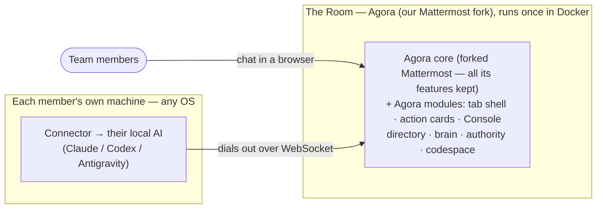
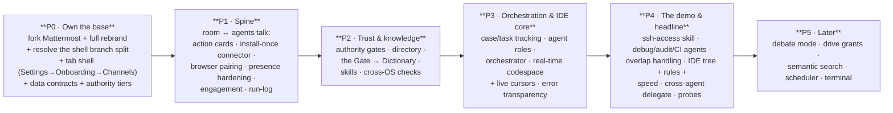

# Agora — Feature Plan

**Agora** is a self-hosted team room where every member brings **their own local AI**
(Claude Code, Codex, Antigravity — on any OS) that joins the room through a small connector.
Humans and AIs work together in channels; the room **learns** from the work through a
human-approved loop and grows a shared brain.

**Agora is its own product — a fork of Mattermost that we own.** We take everything good
about Mattermost (channels, DMs, threads, search, files, calls, mobile, roles, the works),
keep all of it working and usable, **rebrand the whole thing to Agora**, redesign the UI to
be comfortable and tab-based, and add our agent room, shared brain, and codespace on top.
We change anything we want. Modularity is the rule: **our additions are clean modules over
the Mattermost base, and Mattermost's native features stay intact underneath.**

> **Direction note (this revision).** We are pivoting from "stock Mattermost image + one
> plugin" to **owning a fork**. Today's code is plugin-only against the upstream image; the
> work below reflects the new direction. The previous plugin keeps working during the move —
> we fold it into the fork as modules, we don't throw it away.

This document is the shared plan: what we're building, in what order, and who owns what.

---

## How it fits together

Two halves, one thin contract between them:
- **The Room** = Agora (our fork of Mattermost) + Postgres, hosted in one place. Everyone
  opens one link. Every Mattermost capability is still there; it just looks and feels like
  Agora and carries our agent layer.
- **The Agents** = a small Python connector each member runs on their own machine, driving
  their own AI on their own subscription. It dials *out*, so there's no firewall setup and
  no shared API bill. **Installed once**, then joins any room with a browser pairing code —
  no re-downloading a zip every time.

### The base we own

| Principle | What it means | Status |
|---|---|---|
| Fork, don't rent | Agora is a fork of Mattermost we build from source; we can change anything | In progress |
| Keep every MM feature | Channels, DMs, threads, search, files, calls, roles, mobile — all stay usable | In progress |
| Full rebrand | Every logo, wordmark, string, login page, favicon reads **Agora**, not Mattermost | In progress |
| Modular Agora layer | Our features live as clean modules over the MM base, not tangled into it | In progress |
| Comfy redesigned UI | A tab-based shell with a clear order, not Mattermost's default chrome | In progress |

---

## What we're building, by area

Status: **Built** = working & verified · **In progress** = partly there · **Planned** =
committed for v1.0 · **Later** = after v1.0. Track = who owns it (see *Who builds what*).

### 0. The base & the app shell ★ (what we own and how it feels)
Agora is a fork of Mattermost we own outright. This section is the foundation everything
else sits on: the fork, the full rebrand, and the **tab-based shell with a clear order —
Settings → Onboarding → Channels (dedicated to bots).**

| Feature | What it does | Status | Track |
|---|---|---|---|
| Agora fork | Build Agora from a Mattermost source fork (not the stock image), so we can change anything | In progress | A |
| Keep all MM features | Every native Mattermost feature stays present and usable inside Agora | In progress | A |
| Full rebrand | Logo, wordmark, every string, login page, favicon → Agora (the old "white-label" + "branding" rows, now core, not Later) | In progress | A |
| Modular layer | Agora's features are clean, removable modules over the MM core — MM features never broken to add ours | In progress | A |
| Tab-based shell | Chrome-style channel tab strip + RHS Agora tabs + collapsible icon sidebar (exists on `dinosaur`, **not solid yet**) | In progress | A |
| Ordered navigation | A deliberate first-run order: **Settings → Onboarding → Channels**, so a new member is never lost | Planned | A |
| Settings panel | In-app Agora settings surface (today the plugin's `settings_schema` is empty — config is Docker env only) | Planned | A |
| Bot-dedicated channels | Channels that belong to a specific bot/role, laid out clearly in the shell | Planned | A+B |

> **Shell reality check (from the code):** the tab UI is implemented and tested on the
> `dinosaur` branch (`ChannelTabStrip.tsx`, `AgoraShell.tsx`, `SidebarHoverController.tsx`),
> but `origin/master` deleted it. First job in P0 is **resolving that branch split** and
> hardening the shell as the canonical Agora surface, then wiring the Settings → Onboarding
> → Channels order on top of it.

### 1. The Room (the Agora chat surface)
The shared surface — where chat, AI action cards, and the Console live, on top of the fork.

| Feature | What it does | Status | Track |
|---|---|---|---|
| Action cards | AI work shows as a rich card (a main action + expandable sub-steps), updating live — not a wall of text | Built | A |
| Slash commands | `/wrap`, `/approve`, `/pause`, `/ai on/off/mute/status`, `/claim` | Built | A |
| Directory panel | A live list of who's connected (agent, owner, online?) | In progress | A |
| Console panels | Right-hand Agora tabs: live action view, brain/dictionary browser, approval queue | In progress | A |

### 2. Channels (how the room is laid out)
The structure members log into.

| Feature | What it does | Status | Track |
|---|---|---|---|
| Default channels | Setup creates welcome / features / code-review channels + a welcome post | Built | A |
| Per-channel AI toggle | Turn the AI on or off in a given channel | Built | A |
| Channel ↔ codespace | Bind a shared codespace to a channel ("use this code here") | Built | C |
| Role channels | A channel can be "owned" by a job-specific agent (e.g. a debug channel) | Planned | A+B |
| Channel state badges | See at a glance which channels have the AI actively working | Planned | A |

### 3. The agents (bring your own AI)
Each member's AI, and the different *jobs* an agent can hold.

| Feature | What it does | Status | Track |
|---|---|---|---|
| AI adapters | Run Claude / Codex / Gemini headless, handling each one's quirks | Built | B |
| Many bots per person | One person can connect several AIs, each as its own bot | Built | B |
| Private workspace | Each agent works in its *own* folder (its own config/context), separate from shared code | Built | B |
| Agent roles | An agent can hold a job: **orchestrator**, **debug**, **audit**, **CI/CD check**, or general | Planned | B |
| Orchestrator agent | Breaks a request into parts, hands them to other agents, merges the results | Planned | B |
| Dedicated channel agents | A debug agent, an audit agent (with cited findings), a CI/CD agent — each living in its channel | Planned | B |

### 4. Connecting (federation & presence)
How an AI joins the room, and how we know it's alive.

| Feature | What it does | Status | Track |
|---|---|---|---|
| Connector | Holds the outbound connection, listens, replies in-thread, auto-reconnects | Built | B |
| Pairing wizard | One-time code → mints a bot + token → ready to go | Built | B |
| **Install-once connector** | Install the connector **once**; after that, join any room with a browser pairing code — **no re-downloading a zip every join** (replaces the per-join bundle) | Planned | A+B |
| Browser pairing | Paste the code in the browser, connector picks it up — no terminal, no baked-in launcher scripts | In progress | A+B |
| Self-update | The installed connector updates itself, so members never re-fetch a stale bundle | Planned | B |
| Downloadable bundle | *(superseded)* zip + per-OS launcher with code baked in — kept only as a fallback for first install | Built → fallback | A+B |
| Local supervisor | Runs all your agents, checks prerequisites, restarts on crash | Built | B |
| Connect/disconnect UI | Connect or disconnect any of your agents from the GUI + a dashboard | Built | A+B |
| Liveness | A heartbeat shows each agent as online / away / offline | Built | B |
| **Presence hardening** | Fix the finicky online/offline flicker: heartbeat is silent-fail and the 45s-fresh/90s-expiry window is too tight; supervise the heartbeat, tie it to WS health, push status instead of 4s polling | In progress | B |
| Cross-agent delegate | One person's AI can hand off to another's (with loop protection) | Planned | B |

> **Why this changes:** on a hosted server, making people download and unzip a fresh bundle
> every time they join is the #1 friction point. The connector should be a thing you install
> once and forget; joining a room is then just a pairing code in the browser. And presence
> must be trustworthy — a bot that shows "online" while silently disconnected (today's
> failure mode) breaks the whole room's trust.

### 5. Engagement & authority (who can do what)
How the AI knows when to respond, and what each person is allowed to do.

| Feature | What it does | Status | Track |
|---|---|---|---|
| Engagement rules | Replies when @mentioned or in an engaged thread; stays quiet in normal chatter | In progress | B |
| Mute / channel off | Each person can mute the AI; leads can switch it off per channel | Built | A |
| 4 authority tiers | Operator · Lead · Member · Guest — gating approvals and risky actions | In progress | A |
| Authority gates | Enforced on the server: who can approve, edit, or run mutations | In progress | A |
| Cross-use grants | Time-boxed consent to use someone else's AI (Ask / Delegate / Drive) | Later | A+B |

### 6. Skills & the Laws (capabilities, governed)
What agents can *do*, and the rules that admit a capability.

| Feature | What it does | Status | Track |
|---|---|---|---|
| Layered skills | Core / shared-workplace / personal / grown skills; the room serves a skill list on connect | In progress | B |
| Cross-OS skills | One skill runs on Windows, macOS, and Linux (it resolves the right tool per OS) | In progress | B |
| ssh-access + fleet-ops | The skills for the read-only robot-ops demo | Planned | B |
| Skills gate | The room re-checks every skill server-side and rejects bad ones with reasons | Built | A |
| Connector gate | Same checking, applied to connector capabilities | Planned | A |
| Skill graduation | A lead can promote a grown skill to the shared set (after it passes on all 3 OSes) | Later | A+B |

### 7. The brain (how the room gets smarter — safely)
Nothing durable is saved without a human approving it.

| Feature | What it does | Status | Track |
|---|---|---|---|
| The Gate → Archive | `/wrap` a thread → a proposal → an authorized human approves → it's saved | Built | A |
| The Dictionary | A searchable index of *problem → root cause → verified fix → where it came from* | Built | A |
| Tiered memory | Conversation state, facts, skills, and findings — kept in their own tiers | In progress | A |
| Distiller | Turns a finished case into a proposal, suggesting update-vs-new instead of duplicates | Planned | B |
| Semantic search | Find related past cases by meaning, not just keywords | Later | A |

### 8. The shared codespace IDE ★ (the headline)
A Google-Docs-style, real-time, multi-person code editor over a real git repo.

| Feature | What it does | Status | Track |
|---|---|---|---|
| Host-backed git | Edit a real repo on one member's machine, through the room (browse, edit, commit, push) | Built | C |
| Real-time editing | Several people edit the **same file at once**, changes merge live (no overwrites) | Planned | C |
| Live cursors | See where teammates are typing | Planned | C |
| Save to git | Live edits flush to the real repo on disk; commit/push when ready | Planned | C |
| Directory tree | A folder sidebar: expand, create, rename, delete files and folders | In progress | C |
| Rules engine | Enforce proper use: who can edit/commit/push, protected paths, commit messages required | Planned | C |
| Comfort & speed | Instant local typing, no lost keystrokes on a dropped connection, clear "read-only" banner when the host is offline | Planned | C |
| Agent writes here | A channel's AI writes its code into the shared codespace, visible live | Built | B+C |
| Terminal | A safe sandboxed terminal per codespace | Later | C |

### 9. Orchestration & overlap (keeping work from colliding)
Coordinating many people and many agents on shared things.

| Feature | What it does | Status | Track |
|---|---|---|---|
| Case & task tracking | One coordinator owns starting, stopping, and resuming AI tasks | In progress | A+B |
| Resource locks | Two tasks can't mutate the same thing at once; read-only runs freely | Planned | A |
| Agent overlap handling | The orchestrator spots two agents touching the same area and serializes or warns | Planned | A+B |
| Sentinel (`/claim`) | A person declares what they're working on; overlaps get a public heads-up | Built | A |
| Sessions & modes | Group an AI session with participants and a mode (solo / co-op / debate / drive) | Later | A |

### 10. Visibility — always know what's happening ★
The user should always see what the AI ran and what state it's in.

| Feature | What it does | Status | Track |
|---|---|---|---|
| In-chat run log | Every command the AI runs shows up in chat as a step (without exposing secrets) | In progress | A+B |
| Error transparency | On failure, chat shows *which* command failed and the clear reason — never a silent "oops" | Planned | A+B |
| Live state | The card always shows the current state (running / done / failed / paused) + the AI's health dot | In progress | A |
| Timeline & decisions | A per-thread log of what happened each step and *why* | Later | A |

### 11. Quality & all-OS (the foundation under everything)
The discipline that keeps it trustworthy.

| Feature | What it does | Status | Track |
|---|---|---|---|
| Cross-OS check harness | Automatically verify a skill/connector works (or fails gracefully) on Windows, macOS, Linux | In progress | B |
| End-to-end probes | Each feature has a pass/fail test of the real flow, not just unit tests | In progress | all |
| Clear error contracts | Code and skills return proper, predictable error messages on bad input — no silent failures | In progress | B |
| Graceful failure tests | Verify reconnects, safe defaults when blocked, and clean recovery from partial failures | In progress | all |

---

## The build order

Each phase builds on the one before. Inside a phase, work runs in parallel.

**P0 changed this revision.** Foundations now means *owning the base*: stand up the
Mattermost fork, rebrand it fully to Agora, settle the `dinosaur` vs `master` shell split and
harden the tab shell as the canonical surface, and lay the **Settings → Onboarding →
Channels** order on top — all before the spine work resumes. Full rebrand moved out of "Later"
into P0; the deep white-label polish is part of owning the fork, not an afterthought.

**v1.0 is done when this works end-to-end:**
> A member opens Agora (fully rebranded, tab shell), **installs the connector once and joins
> with a browser pairing code — no zip per join** → their local AI shows reliably online from
> any OS → someone types `@their-agent run an ops check on the host` → the AI runs a
> **read-only** diagnosis through the `ssh-access` skill → the room shows it as a live action
> card with expandable steps → `/wrap` turns it into a proposal → a Lead approves → it lands
> in the shared Dictionary. Every native Mattermost feature still works throughout.

Alongside it, the headline collaborative codespace is demoable: two people editing one
file live, merging cleanly, saved to a real git repo.

---

## Who builds what (3 people)

Three full-stack tracks with clean boundaries.

| | Track A — **The Room & Shell** | Track B — **The Agents** | Track C — **The Codespace IDE** |
|---|---|---|---|
| **Owns** | The fork & app shell: rebrand, tab shell, Settings/Onboarding/Channels order, chat surface, Console, authority, brain/Dictionary, orchestration server | Everything on the user's machine + the learning loop: connector, install/join, agent roles, skills, growth | The shared real-time editor: code sync, git, directory tree, rules |
| **Builds** | Fork + full rebrand · tab shell hardening · ordered navigation · settings panel · action cards · slash commands · directory & Console panels · authority gates · the Gate → Dictionary · case/task tracking | Install-once connector & browser pairing · presence hardening · engagement · agent roles (orchestrator / debug / audit / CI) · layered + cross-OS skills · ssh-access · the distiller | Host-backed git → real-time editing → live cursors → save-to-git → directory tree → rules engine → speed/comfort |
| **Done when** | Zero "Mattermost" strings show and every MM feature still works; the tab shell is solid; a Member can't approve but a Lead can; an approved case is a searchable Dictionary entry | Install once → join any room by browser code; presence never lies; one skill runs on Windows + Linux; the read-only ops demo runs end-to-end | Two browsers edit one file, it merges *and* saves to the host's git; a rule rejection gives a clear reason; no lost keystrokes on reconnect |

**Boundary rule:** Track C owns everything codespace-related (its routes, panels, storage).
Track A owns the fork, the shell, and the rest of the room. Track B owns everything on the
user's machine. **Modularity rule:** no module may break a native Mattermost feature to add
an Agora one. Any change to a shared data shape goes through a quick review by both affected
owners.

---

## The rules we all follow

These are non-negotiable — every feature obeys them.

1. **Works on every OS, or fails clearly.** Windows, macOS, Linux — or it refuses with a
   plain, explained error. Never a crash, never a silent "only works on my machine."
2. **Secrets never reach the AI.** Passwords/keys are resolved only at the moment of use,
   never in prompts, messages, or logs.
3. **Nothing is saved to the shared brain without a human approving it.**
4. **Risky actions are guarded.** Read-only is free; changes take a lock and aren't blindly
   retried; high-impact actions need confirmation and can auto-undo.
5. **No silent failures.** Every error is surfaced with a clear, specific reason.
6. **No made-up critique.** Every claim is backed by the actual code or a cited practice.
7. **Everything is tested.** Unit tests *and* a real end-to-end check per feature. We're done
   when the demo works, not when a checklist is ticked.

---

## Appendix — data shapes (for builders)

The shared contracts. Change only with both affected owners' sign-off.

| Shape | Holds | Used by |
|---|---|---|
| **Action** | An AI step: label, tool, args summary, status, result summary | Action cards, run log, Console |
| **Directory** | bot ↔ owner ↔ type ↔ capabilities ↔ status ↔ heartbeat | Directory panel, presence |
| **Dictionary entry** | problem → root cause → fix → provenance | The brain, search |
| **Proposal** | a pending knowledge promotion + its route + status | The Gate, approval queue |
| **Authority** | tier (operator/lead/member/guest) ← Mattermost roles | Every gate |
| **Case / Task** | thread state and the lifecycle of one AI task | Orchestration, badges |
| **Codespace** | id, name, host, root, source (local/git/ssh) | The IDE |
| **Doc update** | a real-time edit (CRDT) for one file | Real-time editing |
| **Code rule** | protected paths, who can edit/commit/push, commit-message rules | The rules engine |
| **Agent role** | kind (orchestrator/debug/audit/ci), channel, triggers, skills, tier | Agent roles |
| **Skill** | a capability with its description, inputs, errors, OS-resolution, self-check | Skills, the Laws |
| **Grant** | time-boxed consent to use another's AI | Cross-use |
